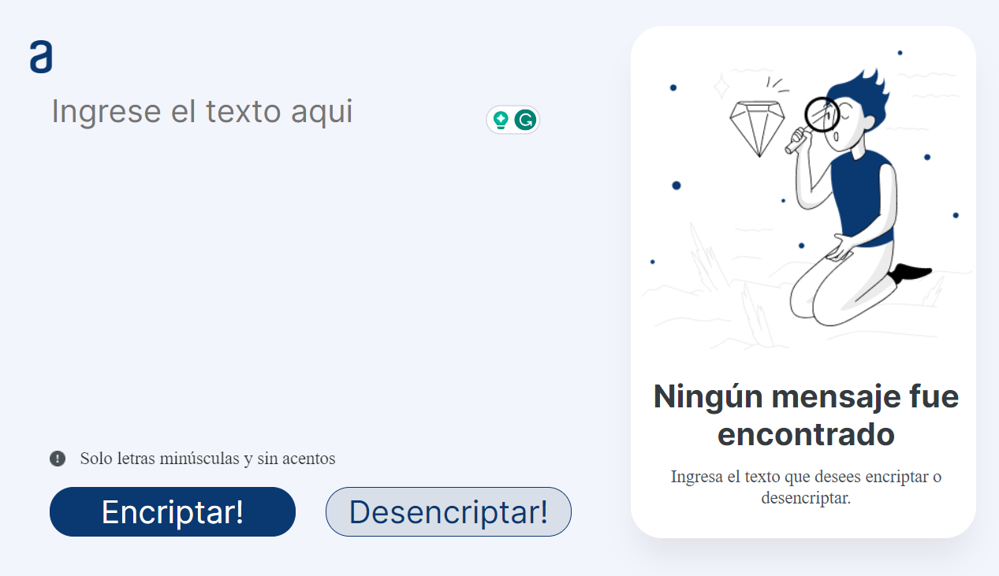

# Alura First Challenge - Text Encryptor and Decryptor

This project is the result of completing the Alura course, where I learned how to code. The "Alura First Challenge" is the final project of the course. It is a web application that allows users to encrypt and decrypt text using JavaScript and CSS.

## Features

- **Text Encryption**: Users can input text, and the application will encrypt it using a custom algorithm.
- **Text Decryption**: Users can also decrypt the encrypted text, returning it to its original form.
- **Character Limit**: The application has a character limit of 250 characters to prevent abuse.

## Technologies Used

- JavaScript
- CSS

## How to Use

To use the Text Encryptor and Decryptor:

1. Clone this repository to your local machine.
2. Open `index.html` in your web browser.
3. Enter the text you want to encrypt in the input field.
4. Click the "Encrypt!" button to encrypt the text.
5. To decrypt, paste the encrypted text into the input field and click the "Decrypt!" button.
6. You can copy the encrypted or decrypted text to your clipboard using the "Copy" button.

## Screenshots

## Limitations

- The application only supports lowercase letters and spaces. It does not handle uppercase letters, accented characters, or special symbols.

Feel free to explore the code and improve the project further!

---

**Note:** This project is part of my coding journey, and I'm continuously learning and improving. If you have any suggestions or feedback, please don't hesitate to reach out.

Happy coding! 🚀
